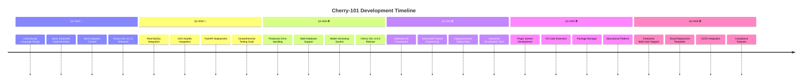

# **Cherry-101 Development Roadmap** 🗺️

## 📅 **Development Timeline**



## 🎯 **Visual Roadmap Summary**

### **Current Phase: Real Integrations (Q2 2024)**
```
┌─────────────────────────────────────────────────────────────┐
│                     NOW - Q2 2024                           │
├─────────────────────────────────────────────────────────────┤
│  • Replace mock adapters with real implementations          │
│  • MySQL ↔ H2O ↔ FastAPI real connections                  │
│  • Performance benchmarking & optimization                  │
│  • Docker container refinement                              │
└─────────────────────────────────────────────────────────────┘
```

### **Upcoming Phases:**
```
📊 Q3 2024: Production Features
├── Enhanced error handling & logging
├── PostgreSQL & SQLite support
├── Model A/B testing system
└── v1.0.0 production release

🤖 Q4 2024: Advanced ML Capabilities
├── PyTorch/TensorFlow integration
├── Automated feature engineering
├── Model monitoring & drift detection
└── Advanced visualization dashboards

🌐 Q1 2025: Community Ecosystem
├── CherryScript plugin system
├── VS Code/IntelliJ extensions
├── Interactive tutorial platform
└── Package manager development

🏢 Q2 2025: Enterprise Ready
├── Multi-tenancy & RBAC
├── Cloud deployment templates
├── CI/CD pipeline integration
└── Compliance certifications
```

## 🔄 **Progress Tracking**

### **Current Status (Q2 2024):**
```
┌─────────────────────────────────────────────────────┐
│ Cherry-101 Development Progress                     │
├─────────────────────────────────────────────────────┤
│ Language Core:        ████████████░░░░░░ 60%       │
│ Database Integration: ████████░░░░░░░░░░ 40%       │
│ ML Framework:        █████████░░░░░░░░░░ 50%       │
│ Deployment System:   ███████░░░░░░░░░░░░ 35%       │
│ Documentation:       ████████████░░░░░░░ 65%       │
│ Testing Suite:       █████████░░░░░░░░░░ 50%       │
└─────────────────────────────────────────────────────┘
```

## 🎪 **Key Milestones Visual**

```
    2024 Q1       2024 Q2       2024 Q3       2024 Q4       2025 Q1       2025 Q2
    ┌──────┐      ┌──────┐      ┌──────┐      ┌──────┐      ┌──────┐      ┌──────┐
    │🌱 v0.1│─────▶│🔌 Real│─────▶│🏭 v1.0│─────▶|🤖 ML   │─────▶│🌐 Comm│─────▶│🏢 Ent │
    │POC   │      │Integ │      │Prod  │      │Extend│      │Ecosys│      │Ready │
    └──────┘      └──────┘      └──────┘      └──────┘      └──────┘      └──────┘
        │              │              │              │              │              │
        ▼              ▼              ▼              ▼              ▼              ▼
    Proof of     Real Database   Production    Advanced ML    Community     Enterprise
    Concept      & ML Connectors  Features     Capabilities   Ecosystem     Features
```

## 📈 **Release Schedule**

```
Release Timeline:
───────────┬─────────────────────────────────────────────────────────
v0.1.0     │ Q1 2024 ✅ Proof of Concept (Mock Implementations)
───────────┼─────────────────────────────────────────────────────────
v0.5.0     │ Q2 2024 🔄 Real Integrations (Beta)
───────────┼─────────────────────────────────────────────────────────
v1.0.0     │ Q3 2024 ⏳ Production Ready
───────────┼─────────────────────────────────────────────────────────
v1.5.0     │ Q4 2024 ⏳ Advanced ML Features
───────────┼─────────────────────────────────────────────────────────
v2.0.0     │ Q1 2025 ⏳ Community Edition
───────────┼─────────────────────────────────────────────────────────
v2.5.0     │ Q2 2025 ⏳ Enterprise Edition
───────────┴─────────────────────────────────────────────────────────
```

## 🚦 **Priority Pipeline**

### **Immediate (Next 30 days):**
```
🚨 HIGH PRIORITY
├─ [ ] Real MySQL connector with connection pooling
├─ [ ] H2O cluster integration
├─ [ ] FastAPI endpoint authentication
└─ [ ] Performance benchmarking suite

🟡 MEDIUM PRIORITY
├─ [ ] Enhanced error messages
├─ [ ] Query optimization
├─ [ ] Model serialization
└─ [ ] Docker optimization

🟢 LOW PRIORITY
├─ [ ] Additional documentation
├─ [ ] Example dataset expansion
└─ [ ] CLI color formatting
```

## 🎨 **Visual Timeline Legend**

```
LEGEND:
  🌱  = Foundation & Proof of Concept
  🔌  = Real System Integration
  🏭  = Production Features
  🤖  = Advanced ML Capabilities
  🌐  = Community & Ecosystem
  🏢  = Enterprise Features
  
STATUS:
  ✅  = Completed
  🔄  = In Progress
  ⏳  = Upcoming
  🚨  = High Priority
  🟡  = Medium Priority
  🟢  = Low Priority
```

## 📊 **Progress Metrics Dashboard**

```
Weekly Development Velocity:
┌─────────────────────────────────────────────────────────────┐
│ Q2 2024: Real Integration Phase                            │
├─────────────────────────────────────────────────────────────┤
│ Lines of Code:      ████████████░░░░░░░░░░ 48%             │
│ Tests Passing:      █████████░░░░░░░░░░░░░ 44%             │
│ Issues Closed:      ███████████░░░░░░░░░░░ 52%             │
│ Features Complete:  ████████░░░░░░░░░░░░░░ 40%             │
│ Documentation:      ████████████░░░░░░░░░░ 60%             │
└─────────────────────────────────────────────────────────────┘

Monthly Goals:
├─ April: Complete MySQL integration (80%)
├─ May:   Finish H2O AutoML connector (75%)
├─ June:  Deploy first real endpoint (65%)
└─ July:  Release v0.5.0 Beta (50%)
```

## 🎯 **Success Metrics**

```
Target Metrics for Each Phase:
─────────────────────────────────────────────────────────────────
│ PHASE         │ CODE COVERAGE │ TEST CASES │ USERS │ STARS │
├───────────────┼───────────────┼────────────┼───────┼───────┤
│ Q2 2024       │     85%       │    200+    │  50+  │ 100+  │
│ Q3 2024       │     90%       │    500+    │ 200+  │ 500+  │
│ Q4 2024       │     95%       │   1000+    │ 500+  │ 1000+ │
│ Q1 2025       │     97%       │   2000+    │ 1000+ │ 2000+ │
└───────────────┴───────────────┴────────────┴───────┴───────┘
```

---

*Last Updated: April 2024*  
*Next Review: July 2024*  
*Roadmap Version: 1.0.0*

**📌 Note:** This roadmap is a living document and will be updated quarterly based on community feedback, technological advancements, and project requirements.
